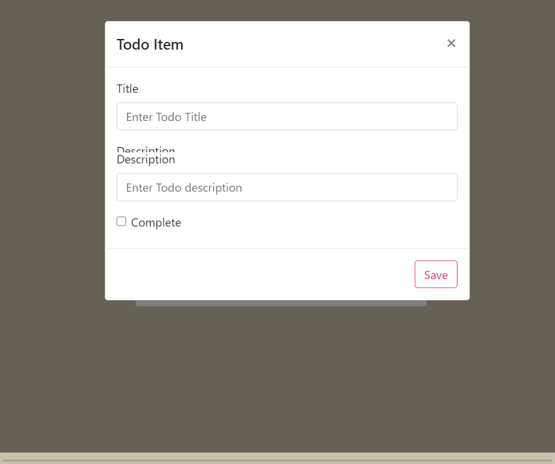
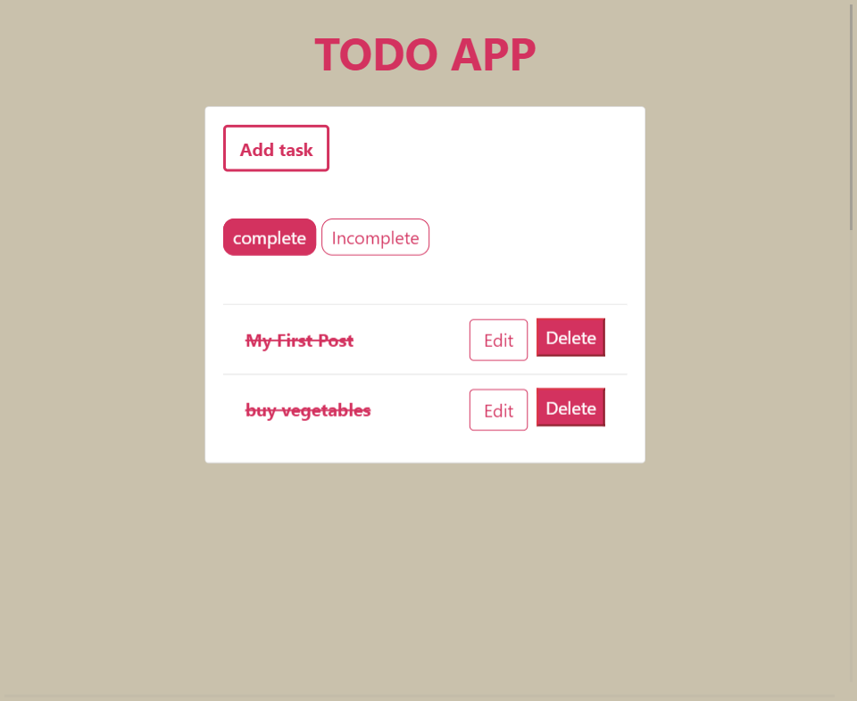
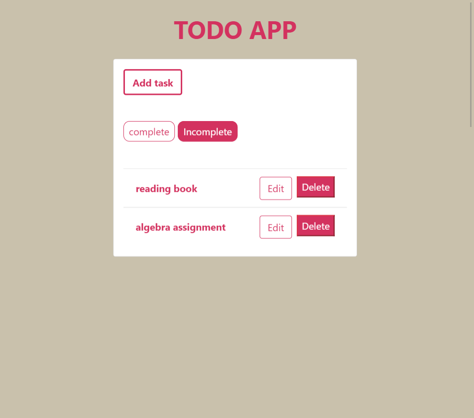

# To-do-list

##screenshots

Created a simple to-do-app using django and react to get the idea of the frameworks
refernce taken: 
https://scotch.io/tutorials/build-a-to-do-application-using-django-and-react
https://www.youtube.com/watch?v=4RWFvXDUmjo&ab_channel=DennisIvy